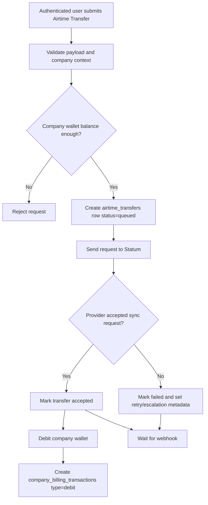
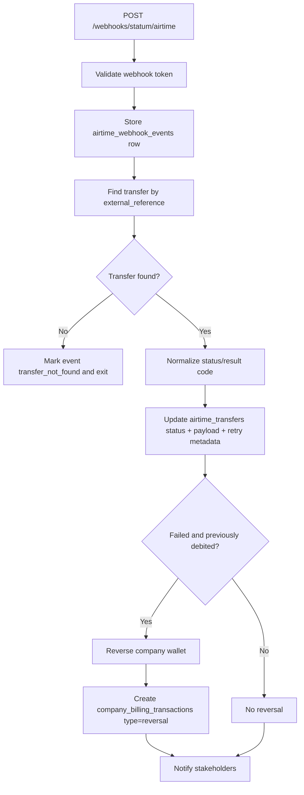
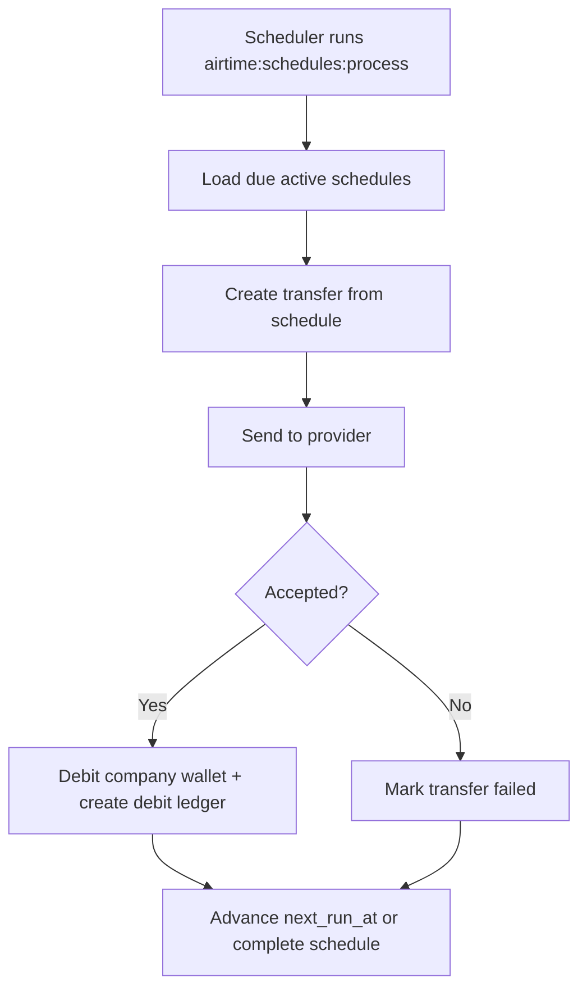
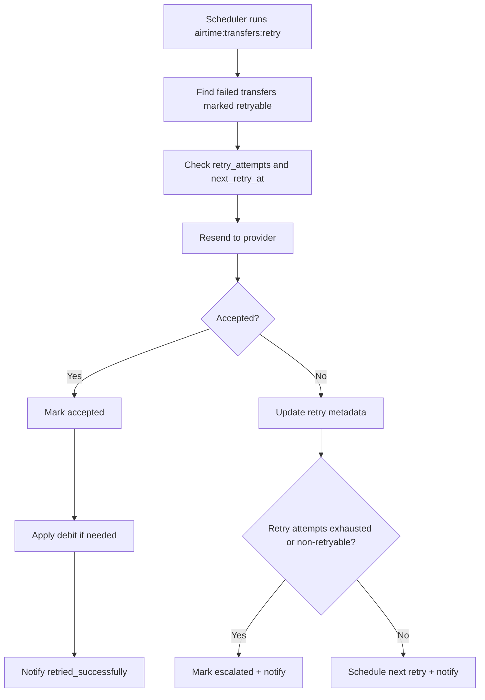
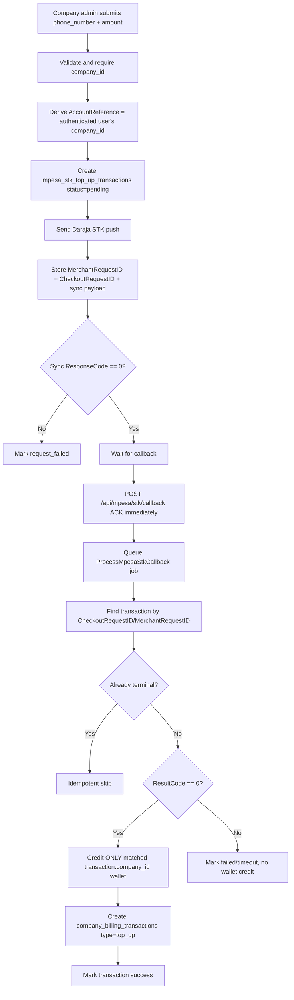
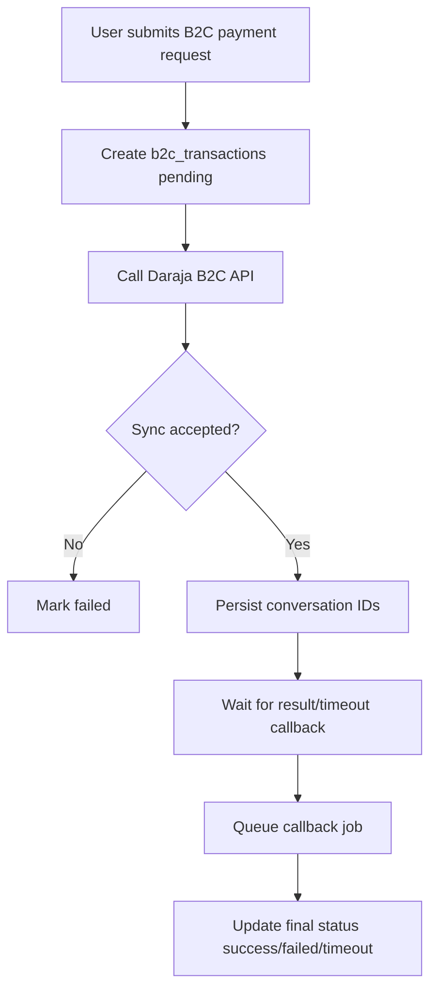
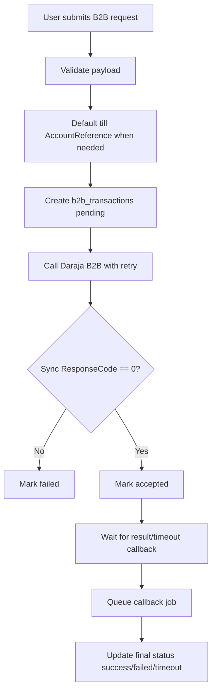

# CreditSaaS Operations Guide

This document explains the live operational flows in the system, including Airtime, Billing, and Mpesa integrations.

## Core Architecture

- App stack: Laravel + Inertia React
- Tenant model: all wallet and transfer operations are company-scoped by `company_id`
- Async processing: callback-heavy workflows are queued for reliability and idempotency
- Scheduler: recurring/failed operations are handled by console commands

## Operations Flow Charts

### 1) Airtime Transfer (Manual)



### 2) Airtime Webhook Processing



### 3) Airtime Schedule Processing



### 4) Failed Airtime Retry Processing



### 5) Billing Wallet Top-Up via Mpesa STK Push (Multi-Company Safe)



### 6) Mpesa B2C Send Money



### 7) Mpesa B2B Payments (PayBill / BuyGoods)



## Security and Isolation Rules

- Account reference for STK is never trusted from the client.
- STK top-up crediting happens only from a matched stored transaction.
- Wallet mutations are tied to one `company_id` per transaction.
- Callback routes can be restricted by allowlisted IPs in production.
- Secrets (consumer secret, passkey, credentials) must never be logged.

## Environment Configuration

Add these variables to `.env`:

```env
MPESA_ENVIRONMENT=production

MPESA_OAUTH_URL=https://api.safaricom.co.ke/oauth/v1/generate
MPESA_B2C_URL=https://api.safaricom.co.ke/mpesa/b2c/v3/paymentrequest
MPESA_B2B_URL=https://api.safaricom.co.ke/mpesa/b2b/v1/paymentrequest

MPESA_CONSUMER_KEY=
MPESA_CONSUMER_SECRET=
MPESA_SHORTCODE=

MPESA_INITIATOR_NAME=
MPESA_INITIATOR_PASSWORD=
MPESA_SECURITY_CREDENTIAL=
MPESA_PUBLIC_KEY_PATH=

MPESA_B2B_INITIATOR_NAME=
MPESA_B2B_SECURITY_CREDENTIAL=
MPESA_B2B_TILL_ACCOUNT_REFERENCE=TILLPAY

MPESA_RESULT_URL=https://yourdomain.com/api/b2c/result
MPESA_TIMEOUT_URL=https://yourdomain.com/api/b2c/timeout
MPESA_B2B_RESULT_URL=https://yourdomain.com/api/mpesa/b2b/result
MPESA_B2B_TIMEOUT_URL=https://yourdomain.com/api/mpesa/b2b/timeout

MPESA_CALLBACK_ALLOWED_IPS=
MPESA_B2B_CALLBACK_ALLOWED_IPS=
MPESA_B2B_CALLBACK_BASIC_AUTH_USER=
MPESA_B2B_CALLBACK_BASIC_AUTH_PASSWORD=
MPESA_B2B_RETRY_ATTEMPTS=3
MPESA_TIMEOUT=30

MPESA_STK_SHORTCODE=
MPESA_STK_PASSKEY=
MPESA_STK_CALLBACK_URL=https://yourdomain.com/api/mpesa/stk/callback
MPESA_STK_INITIATOR_NAME=
MPESA_STK_TIMEOUT=30
MPESA_STK_CALLBACK_ALLOWED_IPS=
MPESA_STK_RETRY_ATTEMPTS=3
MPESA_STK_URL=

STATUM_BASE_URL=https://api.statum.co.ke/api/v2
STATUM_CONSUMER_KEY=
STATUM_CONSUMER_SECRET=
STATUM_WEBHOOK_SECRET=
STATUM_TIMEOUT=30
```

## Main Routes

### UI

- `GET /dashboard`
- `GET /airtime/transfers`
- `GET /airtime/schedules`
- `GET /billing`
- `GET /company/users`
- `GET /mpesa/send-money`

### Airtime

- `POST /airtime/transfers`
- `PATCH /airtime/transfers/{airtimeTransfer}`
- `DELETE /airtime/transfers/{airtimeTransfer}`
- `POST /webhooks/statum/airtime`

### Billing / STK

- `POST /billing/top-ups`
- `POST /api/mpesa/stk/callback`

### Mpesa B2C

- `POST /api/b2c/payment-request`
- `POST /api/b2c/result`
- `POST /api/b2c/timeout`

### Mpesa B2B

- `POST /api/mpesa/b2b/payment-request`
- `POST /api/mpesa/b2b/result`
- `POST /api/mpesa/b2b/timeout`

## Queue and Scheduler

Run workers:

```bash
php artisan queue:work
```

Run scheduler:

```bash
php artisan schedule:work
```

Scheduled commands:

- `airtime:schedules:process` (every minute)
- `airtime:transfers:retry` (every five minutes)

## Test Commands

```bash
php artisan test --compact tests/Feature/AirtimeTransferTest.php
php artisan test --compact tests/Feature/AirtimeScheduleTest.php
php artisan test --compact tests/Feature/BillingTest.php
php artisan test --compact tests/Feature/MpesaB2CTest.php
php artisan test --compact tests/Feature/MpesaB2BTest.php
php artisan test --compact tests/Feature/MpesaStkTopUpTest.php
```
